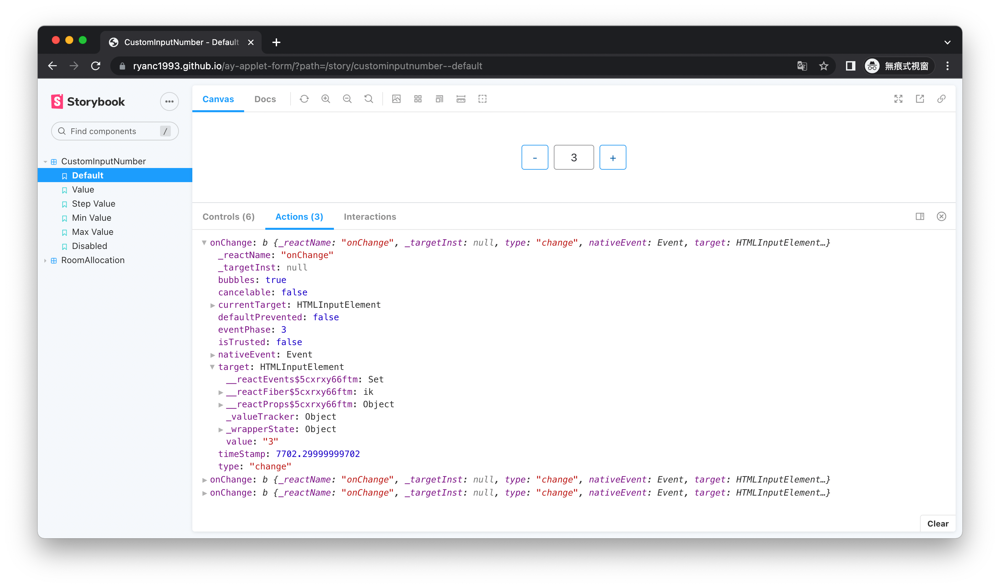

# ay-applet-form
> Componet Doc: https://ryanc1993.github.io/ay-applet-form


Ay React form component library. Written in typescript. Using React.js. Developed with [Webpack](https://webpack.js.org/), [Babel](https://babeljs.io/) and [@Storybook](https://storybook.js.org/).




## File Structure
The mainly structure is as below:
```
ay-applet-form
├── package.json
├── .storybook/                (storybook config.)
├── configs/
│   ├── webpack/               (webpack config.)
├── src
│   ├── components/
│   │   ├── CustomInputNumber/
│   │   ├── RoomAllocation/
│   ├── hooks/
│   ├── index.ts               (entry point.)
├── ...
├── ..
├── .
```

## Develop
```bash
$ git clone git@github.com:ryanC1993/ay-applet-form.git
$ cd ./ay-applet-form
# install dependencies
$ yarn
# serve with hot reload at localhost:6006
$ yarn dev
```
